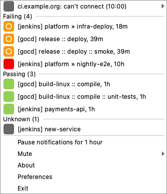
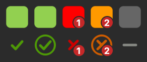

# Tray and menu

1. Projects are grouped under `Failing`, `Building`, `Passing` and `Unknown` headers, each with a count, such as `Failing (2)`. A section with no projects is left out. A failing project that is building again stays under `Failing`. With more than 15 projects, the passing ones move into a `Passing (N)` submenu, while failing and building projects stay in the menu itself.
2. Each project is represented with an icon indicating the last build status, followed by how long ago it last built, such as `18m`, `11h` or `3d`. A long name loses its middle, as in `platform >> very-lo...nightly-e2e, 11h`, so the job name and the time stay visible. Hover over it to see the whole name.
3. A project row shows the server's prefix in brackets when one is set, as in `[jenkins] platform » infra-deploy`. A GitHub server without a prefix uses the repository name, as in `[hello-world] CI (main)`, so two repositories with a `CI` workflow stay apart. A cctray project whose name also appears on another server, and that has no prefix, gets the server's host in brackets. Notifications and the tooltip use the same label. Muting and change detection still go by server and project name, so a label that gains or loses its bracketed part doesn't unmute anything.
4. If the build is still in progress, an activity indicator icon is used to indicate the server activity.
5. All projects in the configured CI servers contribute to the overall build status which is displayed in the tray.
6. The tray tooltip lists failing projects, such as `2 failing: api, web`, with the server count, any pause (`Notifications paused until 11:00`) and the last checked time below it. When every server is down and none has projects from an earlier fetch, it says `Can't reach any server` instead.
7. Clicking on any project in the tray menu would take you to the project page on the CI server.
8. A server that can't be reached gets a row at the top of the menu with its menu prefix (or its host), a short reason and the time it happened, such as `jenkins: can't connect (10:00)` or `ci.example.org: sign-in failed (10:00)`. The row opens a submenu with the full error, a hint when there is one, `Retry now`, which checks every server again, and `Edit server...`, which opens the server dialog. Its projects from the last successful fetch stay in the list.
9. The bottom of the menu has `Check now`, which polls every server immediately instead of waiting for the polling interval, then the pause and mute items, `Preferences...` (`Settings...` on macOS), `About BuildNotify` and `Quit BuildNotify` (`Exit` on Windows). The About box describes the app and links to the project page.

The tray icon shows the overall status: success, success while building (with a ring), failure, failure while building, no data (solid grey) and all servers down (hollow, slashed). When builds fail it also shows how many. The second row is the symbolic set.

