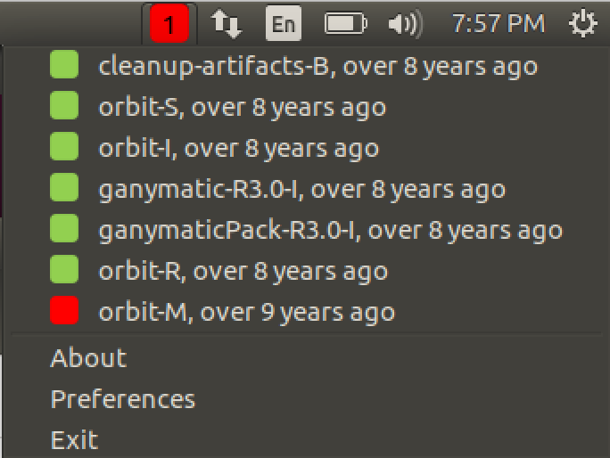

# BuildNotify

 
 
 

BuildNotify is a CCMenu/CCTray equivalent for Ubuntu. It resides in your system tray and notifies you of the build status for different projects on your continuous integration servers. BuildNotify is largely inspired from the awesome CCMenu available for Mac.

* [Installation](installation.md)
* [Frequently asked questions](faq.md)
* [Configuration and usage](usage.md)

# Features

* Monitor projects on multiple CruiseControl continuous integration servers. 
* Access to overall continuous integration status from the system tray.
* Access individual project pages through the tray menu.
* Receive notifications for fixed/broken/still failing builds.
* Easy access to the last build time for each project
* Customize build notifications.

