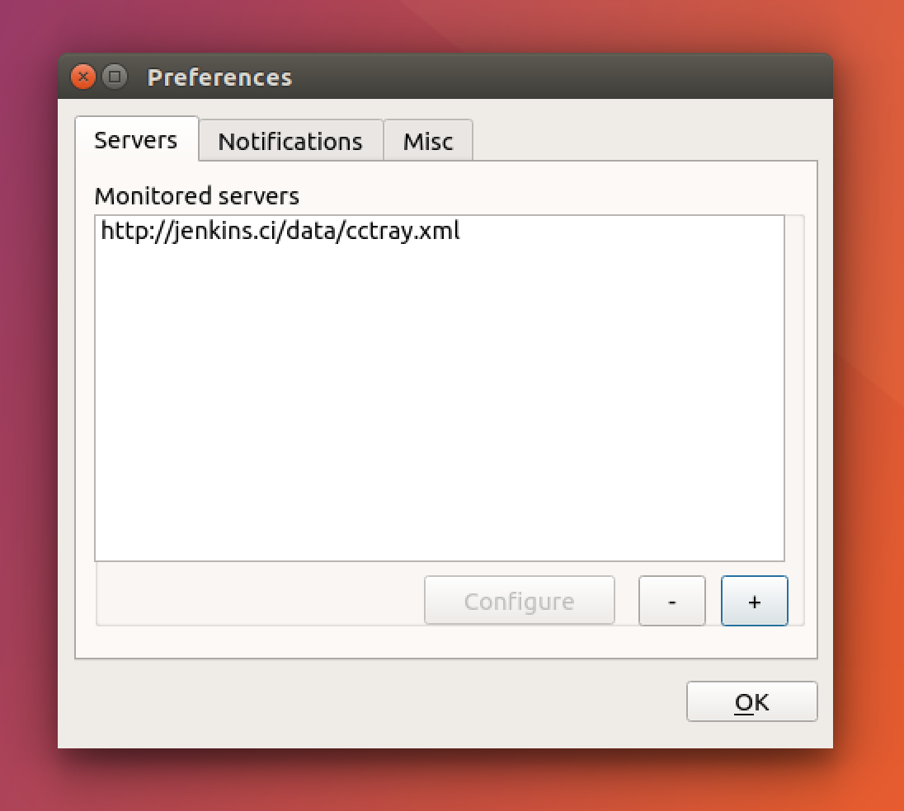
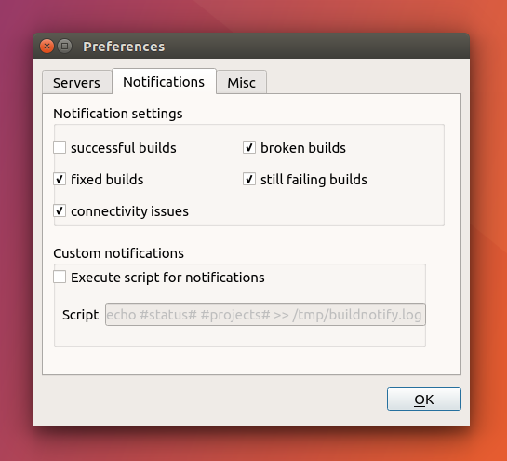
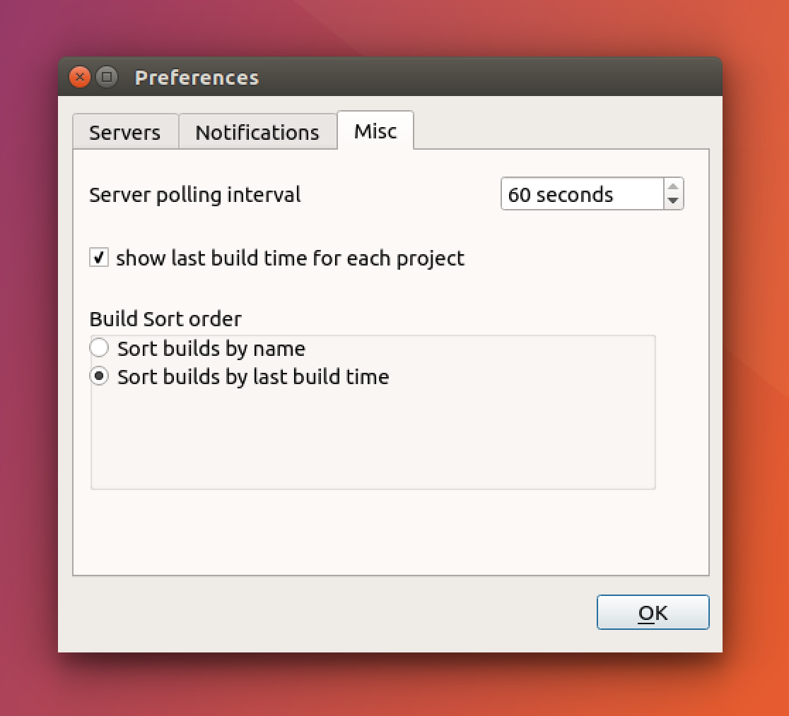

# How to use

Once installed, you should be able to launch Buildnotify using the launcher. You should see a new icon in the notification tray. 

Right click and configure as per the instructions below. 

## Configuration

Given a url pointing to cctray.xml, BuildNotify notifies you of any changes in the project status for selected projects in the CI server. 

Add a new server by clicking the `+` sign

Customize notifications that you'd like to see

Tweak configuration

## Tray Menu
* Each project is represented with an icon indicating the last build status. 
* If the build is still in progress, an activity indicator icon is used to indicate the server activity. 
* All projects in the configured CI servers contribute to the overall build status which is displayed in the tray. 
* Clicking on any project in the tray menu would take you to the project page on the CI server.
