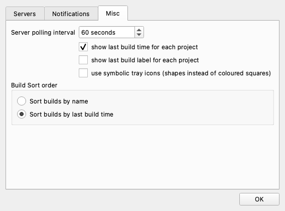

# How to use

Once installed, launch BuildNotify with `buildnotify`. You should see a new icon in the notification tray.

Right click and configure as per the instructions below. On Linux and Windows a left click opens the same menu.

## Configuration

Given a url pointing to cctray.xml, BuildNotify notifies you of any changes in the project status for selected projects in the CI server. The url must start with `http://` or `https://`. If the scheme is missing, BuildNotify adds `http://`.

Add a new server by clicking the `+` sign. Each server can use a username and password or a Bearer token. Both are kept in the system keyring.


Customize notifications that you'd like to see


Tweak configuration



The Misc tab also has an option to show the last build label next to each project, and one to use single-colour symbolic tray icons that differ by shape.

## Custom script

BuildNotify can run a script each time it shows a notification. Turn on "Execute script for notifications" and enter the command. It runs through the platform shell (`/bin/sh` on Linux and macOS, `cmd.exe` on Windows).

The script gets two environment variables:

1. `BUILDNOTIFY_STATUS`: the notification title, such as `Broken builds`, `Fixed builds`, `Build is still failing`, `Yet another successful build` or `Connectivity issues`.
2. `BUILDNOTIFY_PROJECTS`: the affected projects (or server urls for connectivity issues), separated by commas.

For example:

```commandline
notify-send "$BUILDNOTIFY_STATUS" "$BUILDNOTIFY_PROJECTS"
```

Scripts from 2.x can keep using the `#status#` and `#projects#` placeholders. Each one is replaced with a shell-quoted value, and the quoting follows the surrounding quotes, so `notify-send "#status#" "#projects#"` still works. A placeholder escaped with a backslash is left alone.

On Windows, `cmd.exe` has no quoting that makes `&`, `|`, `^` and `%` safe, so a script that uses `#status#` or `#projects#` is not run. BuildNotify logs a warning instead. Read `%BUILDNOTIFY_STATUS%` and `%BUILDNOTIFY_PROJECTS%` in the script.

## Tray Menu

1. Each project is represented with an icon indicating the last build status.
2. If the build is still in progress, an activity indicator icon is used to indicate the server activity.
3. All projects in the configured CI servers contribute to the overall build status which is displayed in the tray.
4. The tray tooltip lists failing projects, such as `2 failing: api, web`, above the last checked time.
5. Clicking on any project in the tray menu would take you to the project page on the CI server.

## Command line options

1. `--settings PATH` reads and writes settings in this INI file instead of the default location. It is handy for trying a configuration without touching your real one.
2. `--debug` logs every fetch.

By default the settings live in `~/.config/BuildNotify/BuildNotify.conf` on Linux, in the macOS preferences, and in the registry under `HKEY_CURRENT_USER\Software\BuildNotify\BuildNotify` on Windows.
