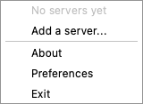

# How to use

Once installed, launch BuildNotify with `buildnotify`. A new icon appears in the system tray. Right-click it to open the menu, where you add servers and open Preferences. On Linux and Windows a left click opens the same menu.

Each part has its own page:

1. [Quick start](quickstart.md): install, add the first server, what you will see.
2. [Servers](servers/index.md): the feed URL and sign in for Jenkins, GoCD, Woodpecker, Crow CI, GitHub Actions and other cctray servers.
3. [Preferences and the server dialog](guide/preferences.md): the server dialog, the Preferences tabs, sort order, keyboard use and command line options.
4. [Tray and menu](guide/tray-menu.md): what the icon, the menu and the tooltip show.
5. [Notifications and custom script](guide/notifications.md): notification kinds, the script environment variables and the Windows limitation.
6. [Muting and pausing](guide/muting.md): silence a server or project, or pause for an hour.

