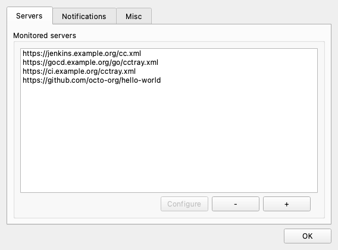
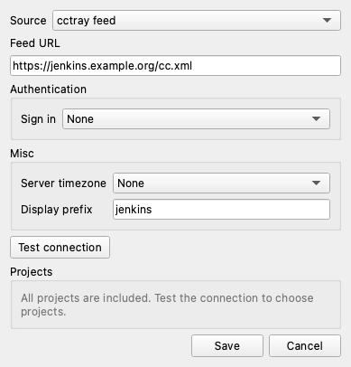
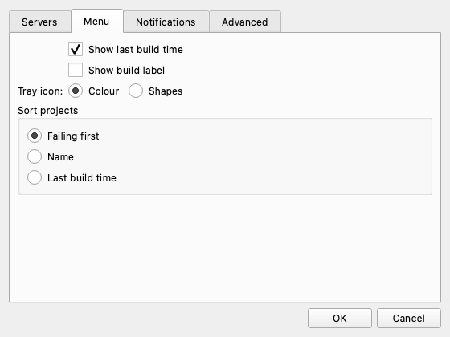
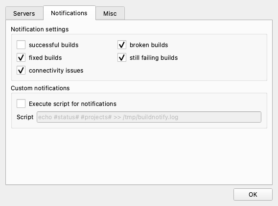
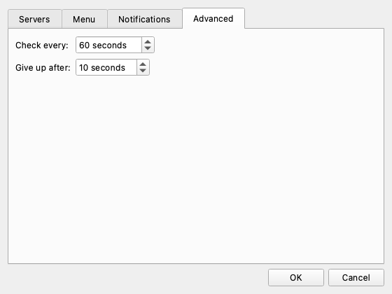
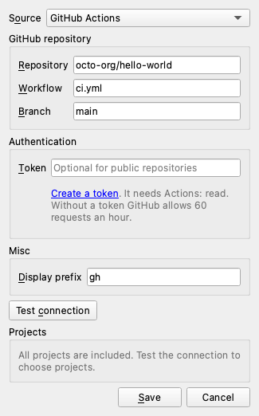

# How to use

Once installed, launch BuildNotify with `buildnotify`. You should see a new icon in the notification tray.

Right click and configure as per the instructions below. On Linux and Windows a left click opens the same menu.

On the first launch with no servers, the server dialog opens once. Until a server is added, the menu offers `Add a server...`, which opens the same dialog.


## Configuration

Given a url pointing to cctray.xml, BuildNotify notifies you of any changes in the project status for selected projects in the CI server. The url must start with `http://` or `https://`. A url typed without one, such as `ci.example.org/cc.xml`, gets `https://`.

Add a new server by clicking the `+` sign. Each server can use a username and password or a Bearer token. Both are kept in the system keyring.

Save works without testing the server first, so you can add one that is down, and all of its projects are included. Test connection shows how many projects the feed has, or a short error, and then lists them so you can untick the ones you don't want. The `All (N of M)` box shows a partial state while some are unticked, and ticking it sets every project the filter field currently shows. Projects added to the feed later are included automatically.

The Servers tab of Preferences lists the monitored servers, one row each with its name (the prefix, else the host), source kind, target and the number of projects found by the last poll. GitHub rows show the repository and `workflow@branch`. `Add...` (Insert), `Edit...` (Enter or double-click) and `Remove` (Delete) change the list, and Remove asks first.





The Menu tab sets how the tray menu looks: show the last build time and label next to each project, pick colour or shape tray icons (single-colour symbolic icons that differ by shape), and choose the sort order.



The Notifications tab picks which events notify you (passes, fails, is fixed, fails again, a server can't be reached) and can run a custom script on each notification.



The Advanced tab sets how often servers are checked and how long to wait before giving up on a request.



The sort order applies within each section of the tray menu. `Failing first`, the default for new installs, puts projects that are building at the top of their section and then shows the newest builds first. Name and last build time sort the whole section that way. An install from an earlier version keeps the sort order it had.

## GitHub Actions

BuildNotify can also watch GitHub Actions without a cctray feed. In the server dialog, set Source to `GitHub Actions` and fill in:

1. Repository: `owner/name`, such as `octo-org/hello-world`.
2. Workflow (optional): a workflow file such as `ci.yml`, or its name. Leave it empty for all workflows.
3. Branch (optional): leave it empty for all branches.
4. Token: a personal access token that can read Actions on the repository. A fine-grained token needs the "Actions: read" permission. Public repositories work without a token, but GitHub then allows only 60 requests an hour. The token is kept in the system keyring.



Each workflow and branch pair shows as one project, such as `CI (main)`. Its status comes from the last finished run: success is green, a failure, time-out or startup failure is red, and a cancelled or skipped run is unknown. While a run is queued or in progress the project shows as building, with the status of the run before it. Clicking a project opens the latest run on GitHub.

BuildNotify reads the 100 most recent runs on each poll, so a workflow that has not run within them drops off the list. With a workflow filter, it reads up to 4 older pages of 100 runs when the newest page has no finished run of that workflow. When GitHub reports that the rate limit is used up, every server that uses the same token is skipped until the limit resets, and the menu shows when it will try again. Servers without a token share one limit. A rejected token, missing access or an unknown repository shows as a short error on the server's menu row. Signing in through the browser (the OAuth device flow) is not supported yet.

## Notifications

BuildNotify shows a notification when a build fails, is fixed, fails again or passes, and when a server can't be reached. Each kind can be turned off in Preferences.

1. A notification about one project names it in the title, such as `Build failed: [jenkins] nightly-e2e`, with the build label below. Clicking it opens the project page.
2. A notification about several projects counts them, such as `3 builds failed`, and lists up to three names followed by `and N more`. Clicking it opens the tray menu.
3. Failures, and servers that can't be reached, use the warning icon. Fixed and passed builds use the information icon.
4. A server that can't be reached is named by its menu prefix or host, as in `Can't reach ci.example.org`. While it stays down the notification repeats after 1, 2, 3, 5, 8, 13 and 21 failed checks, then starts over. When it answers again, `ci.example.org is reachable again` follows.

## Custom script

BuildNotify can run a script each time it shows a notification. Turn on "Execute script for notifications" and enter the command. It runs through the platform shell (`/bin/sh` on Linux and macOS, `cmd.exe` on Windows).

The script gets two environment variables:

1. `BUILDNOTIFY_STATUS`: the kind of notification: `Broken builds`, `Fixed builds`, `Build is still failing`, `Yet another successful build`, `Connectivity issues` or `Connectivity restored`. These are the 2.x notification titles, kept so existing scripts still work, and they differ from the titles BuildNotify now shows.
2. `BUILDNOTIFY_PROJECTS`: every affected project (or server url for connectivity notifications), separated by commas. Unlike the notification, the list is never shortened.

For example:

```commandline
notify-send "$BUILDNOTIFY_STATUS" "$BUILDNOTIFY_PROJECTS"
```

Scripts from 2.x can keep using the `#status#` and `#projects#` placeholders. Each one is replaced with a shell-quoted value, and the quoting follows the surrounding quotes, so `notify-send "#status#" "#projects#"` still works. A placeholder escaped with a backslash is left alone.

On Windows, `cmd.exe` has no quoting that makes `&`, `|`, `^` and `%` safe, so a script that uses `#status#` or `#projects#` is not run. BuildNotify logs a warning instead. Read `%BUILDNOTIFY_STATUS%` and `%BUILDNOTIFY_PROJECTS%` in the script.

## Tray Menu

1. Projects are grouped under `Failing`, `Building`, `Passing` and `Unknown` headers, each with a count, such as `Failing (2)`. A section with no projects is left out. A failing project that is building again stays under `Failing`. With more than 15 projects, the passing ones move into a `Passing (N)` submenu, while failing and building projects stay in the menu itself.
2. Each project is represented with an icon indicating the last build status, followed by how long ago it last built, such as `18m`, `11h` or `3d`. A long name loses its middle, as in `platform >> very-lo...nightly-e2e, 11h`, so the job name and the time stay visible. Hover over it to see the whole name.
3. If the build is still in progress, an activity indicator icon is used to indicate the server activity.
4. All projects in the configured CI servers contribute to the overall build status which is displayed in the tray.
5. The tray tooltip lists failing projects, such as `2 failing: api, web`, above the last checked time. When every server is down and none has projects from an earlier fetch, it says `Can't reach any server` instead.
6. Clicking on any project in the tray menu would take you to the project page on the CI server.
7. A server that can't be reached gets a row at the top of the menu with its menu prefix (or its host), a short reason and the time it happened, such as `jenkins: can't connect (10:00)` or `ci.example.org: sign-in failed (10:00)`. The row opens a submenu with the full error, a hint when there is one, `Retry now`, which checks every server again, and `Edit server...`, which opens the server dialog. Its projects from the last successful fetch stay in the list.


The tray icon shows the overall status: success, success while building, failure, failure while building, and no data. When builds fail it also shows how many. The second row is the symbolic set.


## Muting and pausing

The `Mute` submenu lists each server and each project with a checkbox. A muted server or project gets no notifications, and the custom script does not run for it. Muting a server also mutes all its projects and its connectivity notifications.

Muted projects stay in the menu, marked `(muted)`, and still count towards the tray icon, the failing count and the tooltip. Muting only silences notifications. To hide a project completely, untick it in the server dialog.

`Pause notifications for 1 hour` silences every notification and the custom script until the hour is up. The menu then shows `Resume notifications (paused until 14:05)`, which ends the pause early. Mutes and the pause end time are kept in the settings, so they survive a restart, and a pause that ran out while BuildNotify was closed is over when it starts again.

## Command line options

1. `--settings PATH` reads and writes settings in this INI file instead of the default location. It is handy for trying a configuration without touching your real one.
2. `--debug` logs every fetch.

By default the settings live in `~/.config/BuildNotify/BuildNotify.conf` on Linux, in the macOS preferences, and in the registry under `HKEY_CURRENT_USER\Software\BuildNotify\BuildNotify` on Windows.
